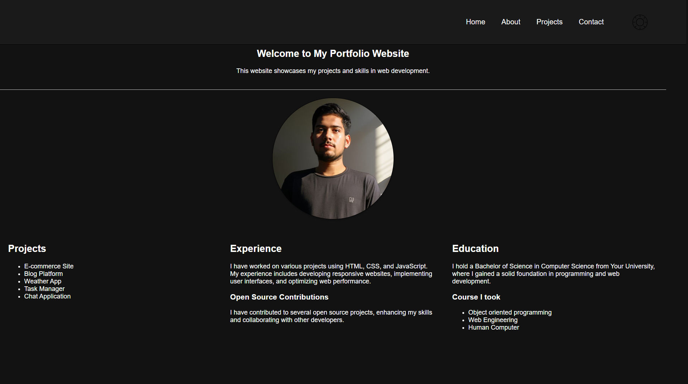
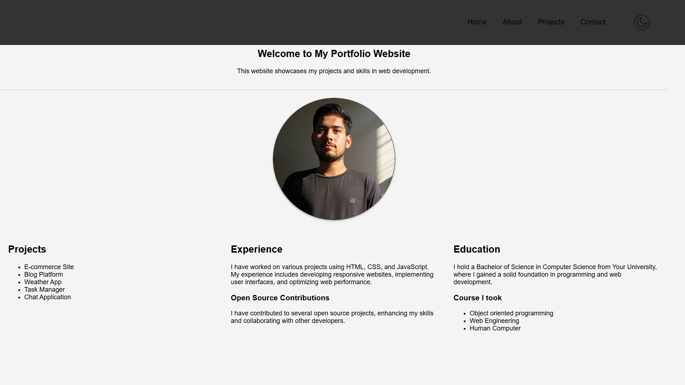

# Personal Portfolio (simple static site)

This folder contains a small personal portfolio website built with plain HTML, CSS, and JavaScript. It's intended as a beginner-friendly starter to showcase projects, skills, and contact information.

## Features
- Responsive layout using CSS Flexbox
- Dark / Light theme toggle with persistence (localStorage)
- Simple, accessible theme toggle (keyboard focus + ARIA)
- Circular profile image with hover effect
- Sections for Home, Projects, Experience, and Education

## Files
- `index.html` — main page markup
- `styles.css` — styling and responsive rules
- `script.js` — theme toggle logic and small UI behaviors
- `image/` — folder for images (profile, icons)

## How to preview
You can open `index.html` directly in a browser, or run a simple local server (recommended so requests for images/CSS behave like a real site).

PowerShell (from the project folder):

```powershell
# start a simple HTTP server on port 8000
python -m http.server 8000
# then open http://localhost:8000 in your browser
```

Or simply double-click `index.html` to open it in your default browser.

## Customization
- Replace the profile image at `image/man.jpeg` (keep aspect ratio square). Use `srcset` variants if you want multiple resolutions.
- Theme icons: `image/dark-mode.png` and `image/light-mode.png`. Replace with your preferred icons or an inline SVG for better scalability.
- Edit the content sections in `index.html` to add your real projects, experience, and contact details.
- Update colors in `styles.css` by changing the `:root` variables (`--primary-color`, `--secondary-color`, `--text-color`).

## Accessibility notes
- The theme toggle is implemented as a `<button id="theme-toggle">` with `aria-pressed` for screen readers and keyboard operability.
- Provide meaningful `alt` text for images used for content (profile image); decorative images can have `alt=""`.
- Consider adding a skip link (`<a class="skip-link" href="#main">Skip to content</a>`) if you expand the site.

## Small suggestions / next steps
- Add a contact form or a mailto: link in the Contact section.
- Use `srcset` for the profile image to serve appropriate sizes on mobile/desktop.
- Add social links (GitHub, LinkedIn) and a favicon.
- Consider minifying CSS/JS when deploying.

## License
Use this project freely for learning and personal demo purposes.


## Look-in-dark-mode

<p align="center">
  
</p>

## Look-in-light-mode
<p align="center">
  
</p>

## Author
Amar Singh